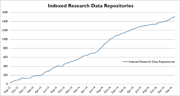

```{r setup, include = FALSE, fig.align = "center"}
knitr::opts_chunk$set(echo = TRUE)
```
## Sharing, publishing and archiving research products

## What is the difference between sharing, publishing & archiving?

**Non-synomymous terms**

- *shared*: any way of sharing information, could mean I emailed it to you.
- *publish* : citable artifact, discoverable.
- *archive* : long-term preservation.

#### We'll be focusing on publishing and archiving

## Why, with whom, what, when, where, and how to publish & archive?

- why publish?
- who are we sharing with?
- what materials do we need to publish?
- when do we make them available?
- where do we publish various outputs?
- how do we prepare materials for publication?

For the remaining slides we will assume tour manuscript is submission ready.

## Why?

- increased visibility / citation
- funding agency / journal requirement
- community expects it

## Increased visibility and citations

[Piwowar & Vision (2013) Data reuse and the open data citation advantage.](https://dx.doi.org/10.7717/peerj.175)


## Funding agency or journal requirements

### Funding agencies
- [NIH Data Sharing policy](http://grants.nih.gov/grants/policy/data_sharing/)
- [NSF Dissemination and Sharing of Research Results poicy](http://www.nsf.gov/bfa/dias/policy/dmp.jsp)

### Journals

- [PLOS Publishing policies](http://journals.plos.org/plosone/s/editorial-and-publishing-policies)
- [Nature Publishing policies](http://www.nature.com/authors/policies/availability.html)

## Why?

- increased visibility and citationa
- funding agency / journal requirement
- community expects it
- *better research*


[Wicherts et al (2011) Willingness to Share Research Data Is Related to the Strength of the Evidence and the Quality of Reporting of Statistical Results.](http://dx.doi.org/10.1371/journal.pone.0026828)

## Why?

### Reproducibility: what’s in it for me?


*more efficient, less redundant science*
    - by allowing others to build upon our work

[Five selfish reasons to work reproducibly](http://www.genomebiology.com/2015/16/1/274) by Florian Markowetz

- Reason number 1: reproducibility helps to avoid disaster
- Reason number 2: reproducibility makes it easier to write papers
- Reason number 3: reproducibility helps reviewers see it your way
- Reason number 4: reproducibility enables continuity of your work
- Reason number 5: reproducibility helps to build your reputation


## Who?

### Whom do we need to share with?

- collaborators
- peer reviewers & journal editors
- broad scientific community
- generally the public

*For research to be reproducible, the research products (data, code) need to be publicly available in a form that people can find and understand them.*

## What?

> ## **Catalog the artifacts you produced this morning**
> - What needs to be published?
> - What does not need to be published?
> - Anything that cannot be published?
>
{: .challenge}

## Activity outcomes

share? **YES!**

- starting data set (raw data)
- metadata
- data cleaning steps
- analysis scripts
- source code
- readme

share? *maybe?*

- processed / cleaned data
- intermediate results

share? **NO!**

- confidential (e.g., patient) data
- material already published
- pre-existing restrictive license
- passwords, private keys


## Activity outcomes

Advice: One way to determine what you need to publish is to go through and redo the analyses in your paper. Make note of the data and code and notes you needed to do that analysis. Make sure all of that is available. This might seem time consuming, but it assures that what you think you did is what you actually did. 

[Computing Workflows for Biologists: A Roadmap](http://journals.plos.org/plosbiology/article?id=10.1371/journal.pbio.1002303)

## When?

You can make your code and data public at any point of the research process.

However, at the point of paper submission, the results in your paper should be reproducible and therefore the data and code used in the paper published.

- Journals now often require it
- Lets the editor and the reviewers accurately review the paper
- There are options for publishing, but keeping things private for just reviewers until the paper is published

## Where?

- Domain-specific data repository (GenBank, PDB)
- Source code hosting service ([GitHub](http://github.com), [Bitbucket](http://bitbucket.com))
- Generic repository ([Dryad](http://datadryad.com), [Figshare](http://figshare.com), [Zenodo](http://zenodo.org))
- Institutional repository
- Sharing services ([RPubs](http://rpubs.com), [iPython Notebook Viewer](http://nbviewer.ipython.org/), Dropbox, Google Drive)

**Discuss**: Contrast with journal supplementary materials.

## Many repositories

[Registry of Research data Repositories](http://re3data.org)



[Growth of re3data.org](http://www.re3data.org/2014/11/over-1000-research-data-repositories-indexed-in-re3data-org/)


Only some of these are archival, meaning they're committing to retaining your data and products for longer periods of time. This is an important consideration depending on your funders requirements. 

## how to choose?

- is there a domain specific repository?
- what are the backup & replication policies?
- is there a plan for long-term preservation?
- can people find your materials?
- is it citable? (does it provide DOIs)
- is your purpose archival, sharing or publication?

## what goes where when?

**You will likely have different artifacts:**

- `Rmarkdown`
- source code
- other documentation
- raw data
- derived data


**Possible workflow:**

- develop data & code on GitHub
- upon publication
    - share markdown on RPubs
    - archive a snapshot of data in Dryad
    - code snapshot to Zenodo
    

## University libraries try to help

Libraries often have good resources for data management plans and information and access to repositories. They are particularly good at thinking about data archives.

Librarians are very helpful and super awesome! They're a great resource. 


##How to share, publish: file formats

**Do's**

- Open source file formats
- Text file formats (.csv, .tsv, .txt)

**Don't's**

- proprietary file formats (.xls)
- data as PDFs or images
- data in Word documents

## how to share, publish: standard data formats

Using standard data formats is sometimes required, but even when it's not, conforming to standards greatly increases opportunties for re-use and understanding. 

## how to share, publish: checklist

- top-level `README` that describes the data or software package
- list files and naming conventions
- describe abbreviations, column names, etc
- installation and usage instructions for software
    - create separate `INSTALL` if long
- citation instructions
    - consider creating a [`CITATION` file](http://blog.rtwilson.com/encouraging-citation-of-software-introducing-citation-files/)
- contribution instructions
    - Github will automatically link to `CONTRIBUTING` file for new issues and pull requests


> ## Documenting your research (in pairs)
>
> - collect all of the to-be-archived artifacts from the preceding lesson into a directory
> _ write a README file that describes the contents of the directory
> - put a license or waiver on it
>
{:. challenge}


## Does copyright apply?

**Copyright applies to creative works**

- source code
- text (manuscripts etc)
- images

**Typically not copyrightable:**

- data, results
- individual records in a database of facts

**Depends on jurisdiction and case:**

- *curated collections of data*?
- *databases*
- *medical images*?

## Choose A License

[Get help choosing a license](http://choosealicense.com/)

## software licensing guide


[Morin, Andrew, Jennifer Urban, and Piotr Sliz. 2012. A Quick Guide to Software Licensing for the Scientist-Programmer.](http://dx.doi.org/10.1371/journal.pcbi.1002598)” 


## Creative Commons
### Open is not open to interpretation

[The Open Definition](http://opendefinition.org/) sets out principles that define “openness” in relation to data and content. It makes precise the meaning of “open” in the terms *open data*, *open content*, and *open source*:

- “Open means anyone can freely access, use, modify, and share for any purpose (subject, at most, to requirements that preserve provenance and openness).”
- “Open data and content can be freely used, modified, and shared by anyone for any purpose”

## Waiving copyright


- CC0 enables scientists, educators, artists and other creators and owners of copyright- or database-protected content to waive those interests in their works and thereby place them as completely as possible in the public domain, so that others may freely build upon, enhance and reuse the works for any purposes without restriction under copyright or database law.

## Dryad requires CC0

[Dryad’s use of CC0](http://datadryad.org/pages/faq#info-cc0) to make the terms of reuse explicit has some important advantages:

- Interoperability: Since CC0 is both human and machine-readable, other people and indexing services will automatically be able to determine the terms of use.
- Universality: CC0 is a single mechanism that is both global and universal, covering all data and all countries. It is also widely recognized.
- Simplicity: There is no need for humans to make, or respond to, individual data requests, and no need for click-through agreements. This allows more scientists to spend their time doing science.

## licenses versus community norms


From the [Panton Principles](http://pantonprinciples.org/faq/#Q11_What_are_community_norms_and_why_are_they_important):
- [...] in the scholarly research community the act of citation is a commonly held community norm when reusing another community member’s work.

- Community norms can be a much more effective way of encouraging positive behaviour, such as citation, than applying licenses. A well functioning community supports its members in their application of norms, whereas licences can only be enforced through court action and thus invite people to ignore them when they are confident that this is unlikely.

## licenses are legal instruments

- Licenses, copyright, terms of use are complicated issues.
- There are legal implications to your choices.
- Citation is a professional norm in science.
    - We have good systems for ensuring proper citation.
    - Would you try to sue someone in court who fails to cite you properly?
- Keep it simple by putting the least-restrictive license possible

*Let scientists do science without having to talk to lawyers.*

## Challenges and concerns about publishing data and code

> ## Discussion
> 
> What are some of the challenges of publishing research products? What are some of the concerns that people have?
>
{: .discussion}